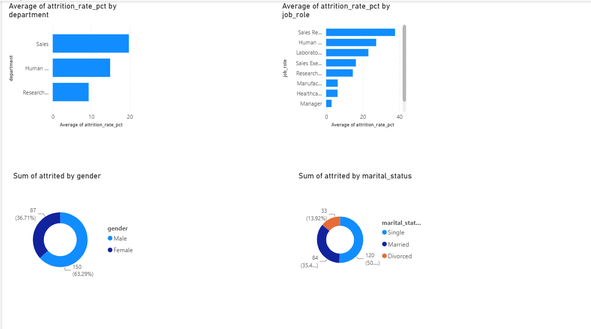
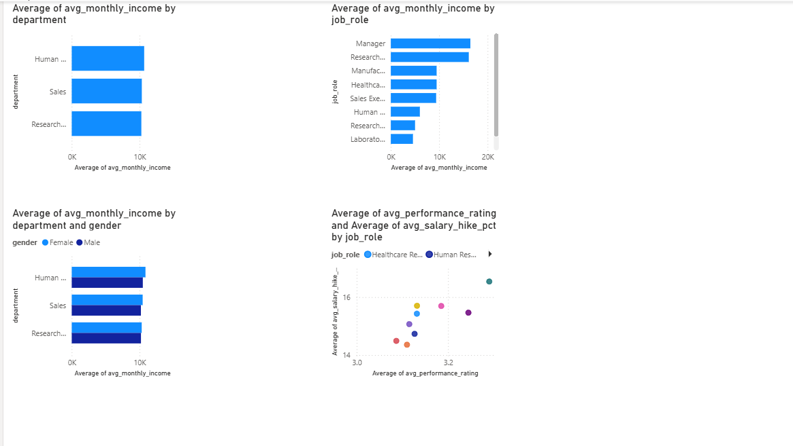
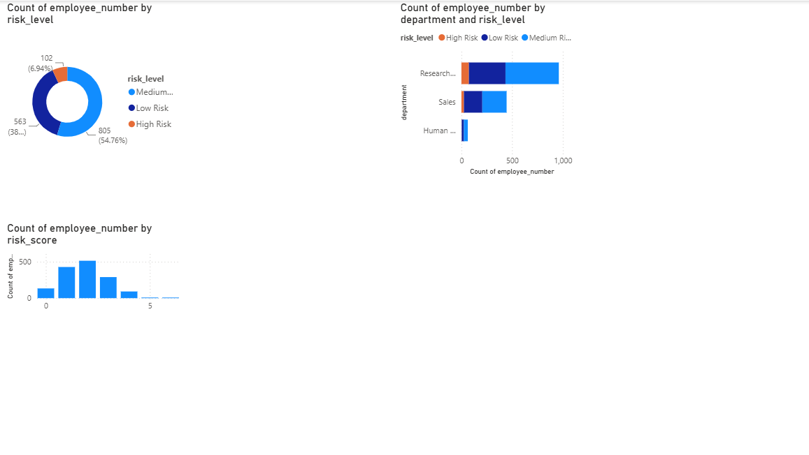
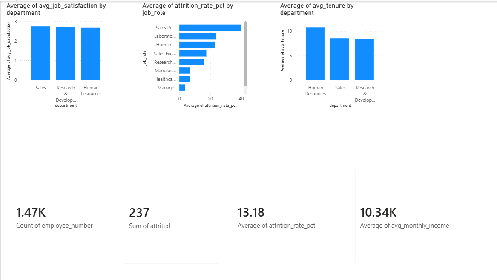

# hr-analytics-employee-attrition
HR analytics project analyzing 1,470 employees using PostgreSQL and Power BI to identify attrition drivers, salary gaps, and at-risk employees
# HR Analytics: Employee Attrition & Performance

## Project Overview
End-to-end HR analytics project analyzing 1,470 employees from the IBM HR 
Analytics dataset using PostgreSQL and Power BI to identify attrition drivers 
and at-risk employees.

## Business Questions Answered
- Which departments and roles have the highest attrition rates?
- Is there a gender pay gap across departments?
- Which employees are at risk of leaving?
- What are the key workforce KPIs?

## Dataset
- Source: [IBM HR Analytics Dataset](https://www.kaggle.com/datasets/pavansubhasht/ibm-hr-analytics-attrition-dataset)
- Size: 1,470 employees, 35 features
- Format: Single CSV file

## Tools Used
- **Database:** PostgreSQL (pgAdmin)
- **Analysis:** SQL (CTEs, CASE WHEN, Window Functions, Views)
- **Visualization:** Microsoft Power BI Desktop

## Project Structure
├── schema.sql                   # Database schema
├── attrition_analysis.sql       # Attrition by dept, role, tenure, gender
├── salary_performance.sql       # Salary vs performance analysis
├── at_risk_employees.sql        # At-risk employee detection model
├── kpi_views.sql                # Power BI ready KPI views
├── HR Analytics.pbix            # Power BI Dashboard file
└── screenshots/                 # Dashboard screenshots

## Key Findings
1. **Overall Attrition Rate:** 13.18% (237 out of 1,470 employees)
2. **Highest Attrition:** Sales department — Sales Representatives most affected
3. **At Risk:** 54.76% employees flagged as Medium Risk, 6.94% High Risk
4. **Gender Pay:** Minimal pay gap observed across departments
5. **Single employees** have highest attrition — work-life balance key factor

## Dashboard Preview
### Page 1 — Attrition Analysis

### Page 2 — Salary & Performance

### Page 3 — At Risk Employees

### Page 4 — Workforce KPI

